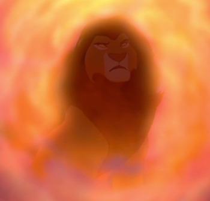

# Beispiel: Mufasa-Seite mit CSS aktualisieren

Hier ist ein praktisches Beispiel, wie du die Mufasa-Seite mit CSS aktualisieren kannst. Folge diesen Schritten, um die Seite zu gestalten und sie richtig cool aussehen zu lassen! Mit CSS kannst du deine Webseite von langweilig zu mega-stylish verwandeln - ohne viel Aufwand. Los geht's!

## Schritt 1: CSS-Datei einbinden

Füge im `<head>`-Bereich den Link zur CSS-Datei ein. Das ist wie das Verbinden deiner Webseite mit ihrem Styling-Handbuch - ohne diesen Link weiß deine Seite nicht, wie sie aussehen soll!

```html
<head>
   <title>Der König der Löwen – Mufasa</title>
   <meta charset="utf-8">
   <link rel="icon" type="image/x-icon" href="favicon.ico" />
   <link rel="stylesheet" href="styles.css">
</head>
```

Der `<link>`-Tag ist super wichtig - er sagt dem Browser: "Hey, schau mal in die styles.css-Datei, da steht, wie alles aussehen soll!" Ohne diesen Link bleibt deine Seite langweilig und unstyled.

## Schritt 2: Logo und Überschrift aktualisieren

Jetzt machen wir das Logo und die Überschrift richtig fett! Statt eines einfachen Bildes und Textes geben wir ihnen spezielle Klassen, damit wir sie später im CSS stylen können.

```html
<!-- Vorher -->

<p>Mufasa</p>

<!-- Nachher -->

<h1 class="character-name">Mufasa</h1>
```

Siehst du den Unterschied? Statt einer normalen Textzeile (`<p>`) verwenden wir jetzt eine richtige Überschrift (`<h1>`). Und mit den Klassen `logo` und `character-name` können wir später im CSS coole Effekte hinzufügen, wie Schatten, Farbverläufe oder Animation!

## Schritt 3: Navigationsleiste erstellen

Eine coole Website braucht eine stylische Navigationsleiste! Hier verwandeln wir die langweiligen Links in eine moderne Navbar:

```html
<!-- Vorher -->
<p>Navigation</p>
<p><a href="#family">Familie</a></p>
<p><a href="#feature">Eigenschaften</a></p>
<p><a href="#video">Video</a></p>

<!-- Nachher -->
<div class="navigation">
   <a href="#family">Familie</a>
   <a href="#feature">Eigenschaften</a>
   <a href="#video">Video</a>
   <a href="index.html">Zurück zur Startseite</a>
</div>
```

Krass, oder? Statt einzelner Absätze packen wir alle Links in einen Container mit der Klasse `navigation`. Das macht es viel einfacher, eine horizontale Menüleiste zu erstellen, die auf allen Geräten gut aussieht. Außerdem haben wir einen Link zur Startseite hinzugefügt - wichtig für die Benutzerfreundlichkeit!

## Schritt 4: Hauptinhalt strukturieren

Jetzt wird's richtig cool! Wir bringen Ordnung in das Chaos und strukturieren den Hauptinhalt so, dass er nicht nur besser aussieht, sondern auch auf Handys und Tablets gut funktioniert:

```html
<!-- Vorher -->
<p>Mufasa (Verehrter König) ist ein großer, kräftiger, gelblich-oranger Löwe mit roter Mähne und Augen.Er ist der Sohn von Ahadi und Uru und großer Bruder von Scar (Taka). Er ist der Vater von Simba, Gefährte von Sarabi und war der wohl beliebteste König des geweihten Landes</p>

<p>Er ist der Sohn von Ahadi und Uru und großer Bruder von Scar (Taka). Er ist der Vater von Simba, Gefährte von Sarabi und war der wohl beliebteste König des geweihten Landes. Er ist ein weiser und gerechter Herrscher, der dem Kreislauf des Lebens folgt. Seine Herrschaft wird auf tragische Weise von seinem Bruder Scar beendet. Sein Sohn Simba sieht ihm sehr ähnlich und ist außerdem sein einziger Sohn. Mufasa bedeutet: Verehrter König. Als Mufasa noch ein sehr kleiner stürmischer junge war, lernte er die mutige Löwin Sarabi kennen. Die beiden wurden ein süßes Paar. Doch Scar wollte Mufasa töten und bekam daher seine Narbe. Mufasa verbrachte viel Zeit mit Sarabi. Als sie erwachsen wurden, waren sie König und Königin und brachten Simba zur Welt. Als Mufasa von seinem Bruder ermordet wurde, wurde Scar König, der daraufhin die Hyänen ins Königreich holte und damit überpopularisierte, was beinah den Untergang des Königreichs bedeutete.
</p>
<p>Später erscheint er seinem Sohn als Geist, dieser stürzte darauf hin Scar vom Thron und das Königreich wurde gerettet.</p>



<!-- Nachher -->
<div class="character-info">
   <p class="character-description">Mufasa (Verehrter König) ist ein großer, kräftiger, gelblich-oranger Löwe mit roter Mähne und Augen. Er ist der Sohn von Ahadi und Uru und großer Bruder von Scar (Taka). Er ist der Vater von Simba, Gefährte von Sarabi und war der wohl beliebteste König des geweihten Landes.</p>
   
   
   
   <p class="character-description">Er ist der Sohn von Ahadi und Uru und großer Bruder von Scar (Taka). Er ist der Vater von Simba, Gefährte von Sarabi und war der wohl beliebteste König des geweihten Landes. Er ist ein weiser und gerechter Herrscher, der dem Kreislauf des Lebens folgt. Seine Herrschaft wird auf tragische Weise von seinem Bruder Scar beendet. Sein Sohn Simba sieht ihm sehr ähnlich und ist außerdem sein einziger Sohn. Mufasa bedeutet: Verehrter König. Als Mufasa noch ein sehr kleiner stürmischer junge war, lernte er die mutige Löwin Sarabi kennen. Die beiden wurden ein süßes Paar. Doch Scar wollte Mufasa töten und bekam daher seine Narbe. Mufasa verbrachte viel Zeit mit Sarabi. Als sie erwachsen wurden, waren sie König und Königin und brachten Simba zur Welt. Als Mufasa von seinem Bruder ermordet wurde, wurde Scar König, der daraufhin die Hyänen ins Königreich holte und damit überpopularisierte, was beinah den Untergang des Königreichs bedeutete.</p>
   
   <p class="character-description">Später erscheint er seinem Sohn als Geist, dieser stürzte darauf hin Scar vom Thron und das Königreich wurde gerettet.</p>
   
   <div class="character-grid">
      
      
      
   </div>
</div>
```

Wow, das ist ein mega Upgrade! Wir haben:
- Alle Inhalte in einem `character-info` Container zusammengefasst
- Jedem Text die Klasse `character-description` gegeben, damit wir ihn später stylen können
- Allen Bildern die Klasse `character-img` und Alt-Text für Barrierefreiheit hinzugefügt
- Die drei Bilder am Ende in einem `character-grid` Container platziert, damit wir sie später als cooles Raster anzeigen können

Mit diesen Änderungen können wir im CSS später z.B. einen schönen Schatten um die Bilder legen, den Text in einer bestimmten Schriftart darstellen oder die Bilder in einer Galerie anordnen!

## Schritt 5: Familie-Abschnitt aktualisieren

Jetzt pimpen wir den Familien-Abschnitt auf! Statt langweiliger Anker-Tags und Absätze machen wir daraus einen richtigen Abschnitt:

```html
<!-- Vorher -->
<a name="family"></a>
<p>Familie</p>
<p><a href="mufasa.html"> Simba</a> (Sohn)</p>
<p><a href="sarabi.html">Sarabi</a> (Ehefrau)</p>
<p><a href="scar.html">Scar</a> (Bruder)</p>
<p>Nala (Schwiegertochter)</p>
<p>Kiara (Enkelin)</p>

<!-- Nachher -->
<div class="section" id="family">
   <h2 class="section-title">Familie</h2>
   <p><a href="simba.html">Simba</a> (Sohn)</p>
   <p><a href="sarabi.html">Sarabi</a> (Ehefrau)</p>
   <p><a href="scar.html">Scar</a> (Bruder)</p>
   <p>Nala (Schwiegertochter)</p>
   <p>Kiara (Enkelin)</p>
</div>
```

Check das aus! Wir haben:
- Den alten `<a name="family"></a>` Anker durch ein modernes `id="family"` Attribut ersetzt
- Einen Container mit der Klasse `section` erstellt, der alle Familienmitglieder umschließt
- Die Überschrift von einem einfachen `<p>` zu einem richtigen `<h2>` mit der Klasse `section-title` aufgewertet

Diese Struktur macht es viel einfacher, den Abschnitt später mit CSS zu stylen - zum Beispiel könntest du einen coolen Hintergrund hinzufügen oder die Links in Buttons verwandeln!

## Schritt 6: Eigenschaften-Tabelle aktualisieren

Auch die Eigenschaften-Tabelle bekommt ein Upgrade:

```html
<!-- Vorher -->
<a name="feature"></a>
<p>Eigenschaften</p>
<table>
   <!-- Tabelleninhalt bleibt gleich -->
</table>

<!-- Nachher -->
<div class="section" id="feature">
   <h2 class="section-title">Eigenschaften</h2>
   <table>
      <!-- Tabelleninhalt bleibt gleich -->
   </table>
</div>
```

Genau wie beim Familien-Abschnitt haben wir hier:
- Den alten Anker durch eine moderne ID ersetzt
- Einen `section`-Container hinzugefügt
- Die Überschrift aufgewertet

Mit dieser Struktur kannst du später im CSS die Tabelle richtig cool gestalten - z.B. mit abwechselnden Zeilenfarben, abgerundeten Ecken oder einem Schatten um die ganze Tabelle!

## Schritt 7: Video-Abschnitt aktualisieren

Der Video-Abschnitt bekommt ein mega Upgrade - von einem einfachen Link zu einem eingebetteten Video-Player:

```html
<!-- Vorher -->
<a name="video"></a>
<p>Video
<p>
<p>https://www.youtube.com/embed/Yw0DXswF5MI</p>

<!-- Nachher -->
<div class="section" id="video">
   <h2 class="section-title">Video</h2>
   <div class="video-container">
      <iframe src="https://www.youtube.com/embed/Yw0DXswF5MI" allowfullscreen></iframe>
   </div>
</div>
```

Das ist ein krasser Unterschied! Statt nur eines Links haben wir jetzt:
- Einen richtigen eingebetteten YouTube-Player mit dem `<iframe>`-Tag
- Einen speziellen Container mit der Klasse `video-container`, der es uns ermöglicht, das Video responsive zu machen (d.h. es passt sich an verschiedene Bildschirmgrößen an)
- Das Attribut `allowfullscreen`, damit Benutzer das Video im Vollbildmodus anschauen können

Mit CSS kannst du später dem Video-Container coole Effekte hinzufügen, wie einen Rahmen oder einen Schatten!

## Schritt 8: Navigation und Footer aktualisieren

Zum Schluss machen wir die Navigation zu den anderen Charakteren und den Footer richtig stylish:

```html
<!-- Vorher -->
<div>
   <div>
      <div>
         Simba
         <ul>
            <li><a href="simba.html#family">Familie</a></li>
            <li><a href="simba.html#feature">Eigenschaften</a></li>
            <li><a href="simba.html#video">Video</a></li>
         </ul>
      </div>
      <!-- weitere Navigationsblöcke -->
   </div>
</div>
<div>
   <div>
      Die Informationen stammen von der <a href="https://de.wikipedia.org/wiki/Wikipedia:Hauptseite"> Wikipedia-Website</a>
   </div>
   <div>
      Kiber One, 2021
   </div>
</div>

<!-- Nachher -->
<div class="section">
   <div class="character-grid">
      <div class="character-card">
         <h3>Simba</h3>
         <ul>
            <li><a href="simba.html#family">Familie</a></li>
            <li><a href="simba.html#feature">Eigenschaften</a></li>
            <li><a href="simba.html#video">Video</a></li>
         </ul>
      </div>
      <!-- weitere Navigationsblöcke mit character-card Klasse -->
   </div>
</div>

<div class="footer">
   <div>
      Die Informationen stammen von der <a href="https://de.wikipedia.org/wiki/Wikipedia:Hauptseite">Wikipedia-Website</a>
   </div>
   <div>
      Kiber One, 2021
   </div>
</div>
```

Das ist ein komplettes Makeover! Wir haben:
- Die Charakternavigation in ein Raster (`character-grid`) umgewandelt, in dem jeder Charakter seine eigene Karte (`character-card`) hat
- Jede Charakterüberschrift zu einem `<h3>` aufgewertet
- Einen speziellen `footer`-Container erstellt, der am unteren Rand der Seite angezeigt wird

Mit CSS kannst du später die Charakterkarten in coole, interaktive Elemente verwandeln - zum Beispiel könnten sie ihre Farbe ändern oder einen Schatten bekommen, wenn man mit der Maus darüber fährt!

## Vollständiges Beispiel

Hier ist ein Ausschnitt der vollständigen aktualisierten Mufasa-Seite:

```html
<html>
   <head>
      <title>Der König der Löwen – Mufasa</title>
      <meta charset="utf-8">
      <link rel="icon" type="image/x-icon" href="favicon.ico" />
      <link rel="stylesheet" href="styles.css">
   </head>
   <body>
      
      <h1 class="character-name">Mufasa</h1>
      <div class="navigation">
         <a href="#family">Familie</a>
         <a href="#feature">Eigenschaften</a>
         <a href="#video">Video</a>
         <a href="index.html">Zurück zur Startseite</a>
      </div>
      
      <div class="character-info">
         <!-- Hauptinhalt -->
      </div>
      
      <div class="section" id="family">
         <!-- Familie-Abschnitt -->
      </div>
      
      <div class="section" id="feature">
         <!-- Eigenschaften-Abschnitt -->
      </div>
      
      <div class="section" id="video">
         <!-- Video-Abschnitt -->
      </div>
      
      <div class="section">
         <!-- Charakternavigation -->
      </div>
      
      <div class="footer">
         <!-- Footer-Inhalt -->
      </div>
   </body>
</html>
```

Vergleiche dieses Beispiel mit der Simba-Seite, um zu sehen, wie die Struktur und Klassen konsistent angewendet werden. Mit diesen Änderungen wird deine Mufasa-Seite nicht nur besser aussehen, sondern auch auf allen Geräten gut funktionieren!
