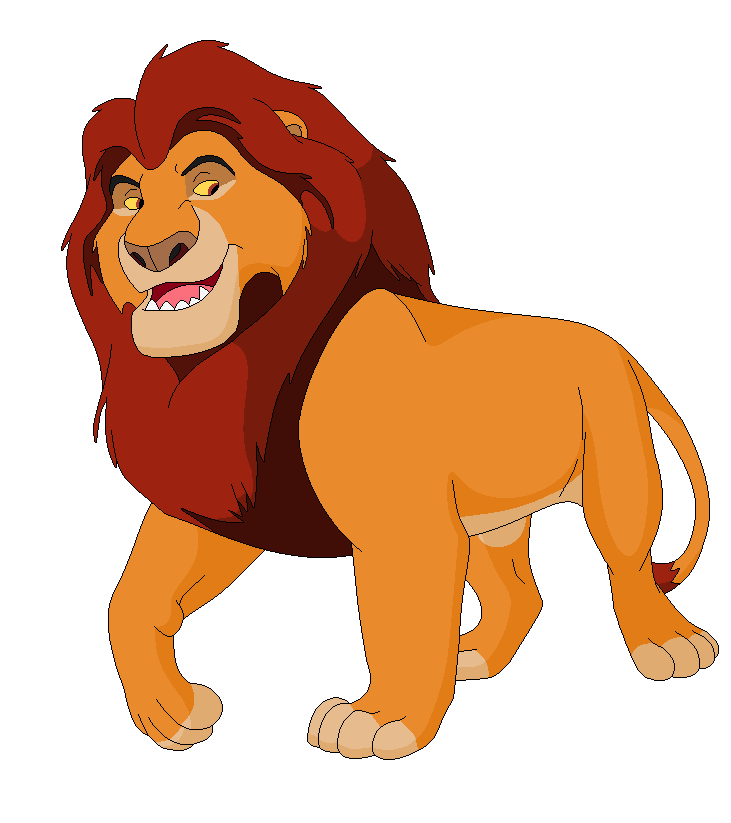
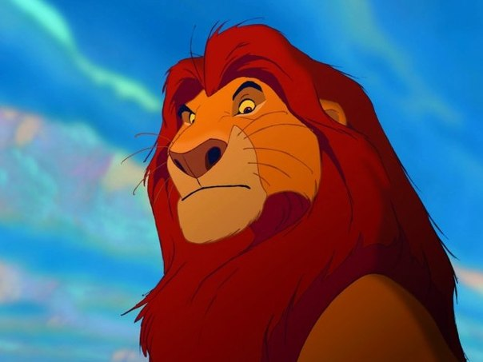

# Beispiel: Mufasa-Seite mit CSS aktualisieren

Hier ist ein praktisches Beispiel, wie du die Mufasa-Seite mit CSS aktualisieren kannst. Folge diesen Schritten, um die Seite zu gestalten.

## Schritt 1: CSS-Datei einbinden

Füge im `<head>`-Bereich den Link zur CSS-Datei ein:

```html
<head>
   <title>Der König der Löwen – Mufasa</title>
   <meta charset="utf-8">
   <link rel="icon" type="image/x-icon" href="favicon.ico" />
   <link rel="stylesheet" href="styles.css">
</head>
```

## Schritt 2: Logo und Überschrift aktualisieren

```html
<!-- Vorher -->

<p>Mufasa</p>

<!-- Nachher -->

<h1 class="character-name">Mufasa</h1>
```

## Schritt 3: Navigationsleiste erstellen

```html
<!-- Vorher -->
<p>Navigation</p>
<p><a href="#family">Familie</a></p>
<p><a href="#feature">Eigenschaften</a></p>
<p><a href="#video">Video</a></p>

<!-- Nachher -->
<div class="navigation">
   <a href="#family">Familie</a>
   <a href="#feature">Eigenschaften</a>
   <a href="#video">Video</a>
   <a href="index.html">Zurück zur Startseite</a>
</div>
```

## Schritt 4: Hauptinhalt strukturieren

```html
<!-- Vorher -->
<p>Mufasa (Verehrter König) ist ein großer, kräftiger, gelblich-oranger Löwe mit roter Mähne und Augen.Er ist der Sohn von Ahadi und Uru und großer Bruder von Scar (Taka). Er ist der Vater von Simba, Gefährte von Sarabi und war der wohl beliebteste König des geweihten Landes</p>

<p>Er ist der Sohn von Ahadi und Uru und großer Bruder von Scar (Taka). Er ist der Vater von Simba, Gefährte von Sarabi und war der wohl beliebteste König des geweihten Landes. Er ist ein weiser und gerechter Herrscher, der dem Kreislauf des Lebens folgt. Seine Herrschaft wird auf tragische Weise von seinem Bruder Scar beendet. Sein Sohn Simba sieht ihm sehr ähnlich und ist außerdem sein einziger Sohn. Mufasa bedeutet: Verehrter König. Als Mufasa noch ein sehr kleiner stürmischer junge war, lernte er die mutige Löwin Sarabi kennen. Die beiden wurden ein süßes Paar. Doch Scar wollte Mufasa töten und bekam daher seine Narbe. Mufasa verbrachte viel Zeit mit Sarabi. Als sie erwachsen wurden, waren sie König und Königin und brachten Simba zur Welt. Als Mufasa von seinem Bruder ermordet wurde, wurde Scar König, der daraufhin die Hyänen ins Königreich holte und damit überpopularisierte, was beinah den Untergang des Königreichs bedeutete.
</p>
<p>Später erscheint er seinem Sohn als Geist, dieser stürzte darauf hin Scar vom Thron und das Königreich wurde gerettet.</p>




<!-- Nachher -->
<div class="character-info">
   <p class="character-description">Mufasa (Verehrter König) ist ein großer, kräftiger, gelblich-oranger Löwe mit roter Mähne und Augen. Er ist der Sohn von Ahadi und Uru und großer Bruder von Scar (Taka). Er ist der Vater von Simba, Gefährte von Sarabi und war der wohl beliebteste König des geweihten Landes.</p>
   
   
   
   <p class="character-description">Er ist der Sohn von Ahadi und Uru und großer Bruder von Scar (Taka). Er ist der Vater von Simba, Gefährte von Sarabi und war der wohl beliebteste König des geweihten Landes. Er ist ein weiser und gerechter Herrscher, der dem Kreislauf des Lebens folgt. Seine Herrschaft wird auf tragische Weise von seinem Bruder Scar beendet. Sein Sohn Simba sieht ihm sehr ähnlich und ist außerdem sein einziger Sohn. Mufasa bedeutet: Verehrter König. Als Mufasa noch ein sehr kleiner stürmischer junge war, lernte er die mutige Löwin Sarabi kennen. Die beiden wurden ein süßes Paar. Doch Scar wollte Mufasa töten und bekam daher seine Narbe. Mufasa verbrachte viel Zeit mit Sarabi. Als sie erwachsen wurden, waren sie König und Königin und brachten Simba zur Welt. Als Mufasa von seinem Bruder ermordet wurde, wurde Scar König, der daraufhin die Hyänen ins Königreich holte und damit überpopularisierte, was beinah den Untergang des Königreichs bedeutete.</p>
   
   <p class="character-description">Später erscheint er seinem Sohn als Geist, dieser stürzte darauf hin Scar vom Thron und das Königreich wurde gerettet.</p>
   
   <div class="character-grid">
      
      
      
   </div>
</div>
```

## Schritt 5: Familie-Abschnitt aktualisieren

```html
<!-- Vorher -->
<a name="family"></a>
<p>Familie</p>
<p><a href="mufasa.html"> Simba</a> (Sohn)</p>
<p><a href="sarabi.html">Sarabi</a> (Ehefrau)</p>
<p><a href="scar.html">Scar</a> (Bruder)</p>
<p>Nala (Schwiegertochter)</p>
<p>Kiara (Enkelin)</p>

<!-- Nachher -->
<div class="section" id="family">
   <h2 class="section-title">Familie</h2>
   <p><a href="simba.html">Simba</a> (Sohn)</p>
   <p><a href="sarabi.html">Sarabi</a> (Ehefrau)</p>
   <p><a href="scar.html">Scar</a> (Bruder)</p>
   <p>Nala (Schwiegertochter)</p>
   <p>Kiara (Enkelin)</p>
</div>
```

## Schritt 6: Eigenschaften-Tabelle aktualisieren

```html
<!-- Vorher -->
<a name="feature"></a>
<p>Eigenschaften</p>
<table>
   <!-- Tabelleninhalt bleibt gleich -->
</table>

<!-- Nachher -->
<div class="section" id="feature">
   <h2 class="section-title">Eigenschaften</h2>
   <table>
      <!-- Tabelleninhalt bleibt gleich -->
   </table>
</div>
```

## Schritt 7: Video-Abschnitt aktualisieren

```html
<!-- Vorher -->
<a name="video"></a>
<p>Video
<p>
<p>https://www.youtube.com/embed/Yw0DXswF5MI</p>

<!-- Nachher -->
<div class="section" id="video">
   <h2 class="section-title">Video</h2>
   <div class="video-container">
      <iframe src="https://www.youtube.com/embed/Yw0DXswF5MI" allowfullscreen></iframe>
   </div>
</div>
```

## Schritt 8: Navigation und Footer aktualisieren

```html
<!-- Vorher -->
<div>
   <div>
      <div>
         Simba
         <ul>
            <li><a href="simba.html#family">Familie</a></li>
            <li><a href="simba.html#feature">Eigenschaften</a></li>
            <li><a href="simba.html#video">Video</a></li>
         </ul>
      </div>
      <!-- weitere Navigationsblöcke -->
   </div>
</div>
<div>
   <div>
      Die Informationen stammen von der <a href="https://de.wikipedia.org/wiki/Wikipedia:Hauptseite"> Wikipedia-Website</a>
   </div>
   <div>
      Kiber One, 2021
   </div>
</div>

<!-- Nachher -->
<div class="section">
   <div class="character-grid">
      <div class="character-card">
         <h3>Simba</h3>
         <ul>
            <li><a href="simba.html#family">Familie</a></li>
            <li><a href="simba.html#feature">Eigenschaften</a></li>
            <li><a href="simba.html#video">Video</a></li>
         </ul>
      </div>
      <!-- weitere Navigationsblöcke mit character-card Klasse -->
   </div>
</div>

<div class="footer">
   <div>
      Die Informationen stammen von der <a href="https://de.wikipedia.org/wiki/Wikipedia:Hauptseite">Wikipedia-Website</a>
   </div>
   <div>
      Kiber One, 2021
   </div>
</div>
```

## Vollständiges Beispiel

Hier ist ein Ausschnitt der vollständigen aktualisierten Mufasa-Seite:

```html
<html>
   <head>
      <title>Der König der Löwen – Mufasa</title>
      <meta charset="utf-8">
      <link rel="icon" type="image/x-icon" href="favicon.ico" />
      <link rel="stylesheet" href="styles.css">
   </head>
   <body>
      
      <h1 class="character-name">Mufasa</h1>
      <div class="navigation">
         <a href="#family">Familie</a>
         <a href="#feature">Eigenschaften</a>
         <a href="#video">Video</a>
         <a href="index.html">Zurück zur Startseite</a>
      </div>
      
      <div class="character-info">
         <!-- Hauptinhalt -->
      </div>
      
      <div class="section" id="family">
         <!-- Familie-Abschnitt -->
      </div>
      
      <div class="section" id="feature">
         <!-- Eigenschaften-Abschnitt -->
      </div>
      
      <div class="section" id="video">
         <!-- Video-Abschnitt -->
      </div>
      
      <div class="section">
         <!-- Charakternavigation -->
      </div>
      
      <div class="footer">
         <!-- Footer-Inhalt -->
      </div>
   </body>
</html>
```

Vergleiche dieses Beispiel mit der Simba-Seite, um zu sehen, wie die Struktur und Klassen konsistent angewendet werden.
